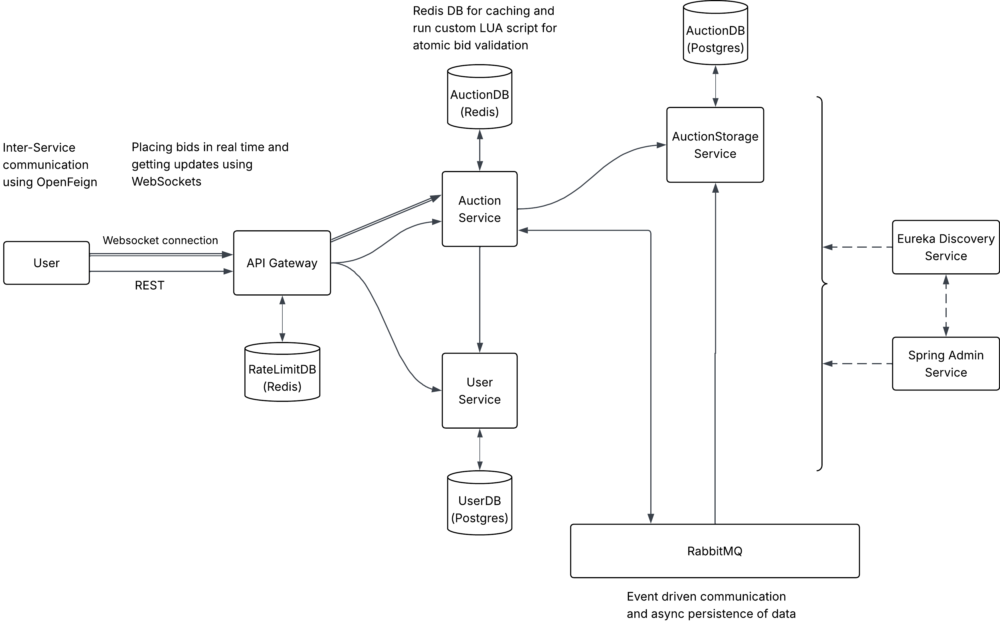
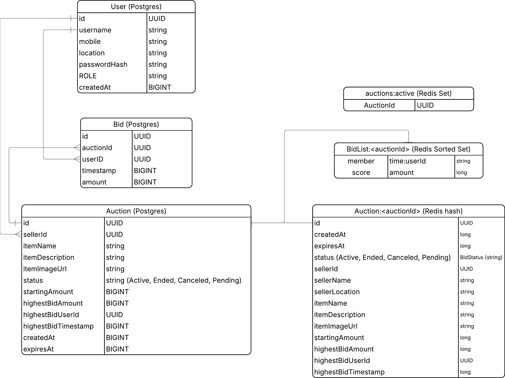
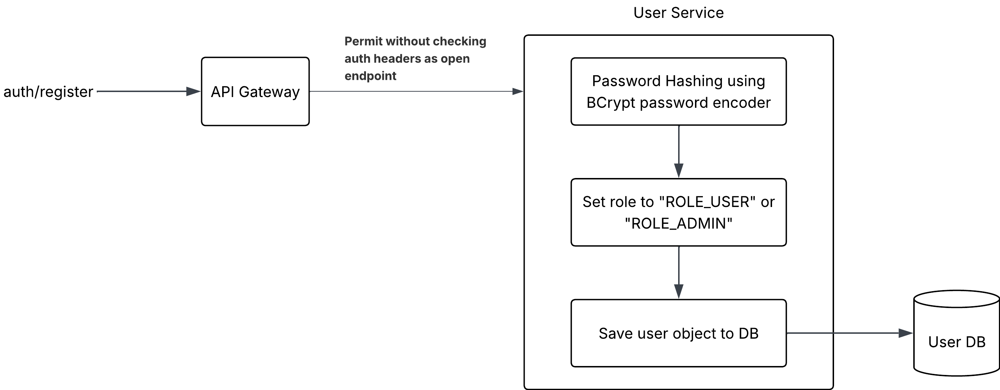
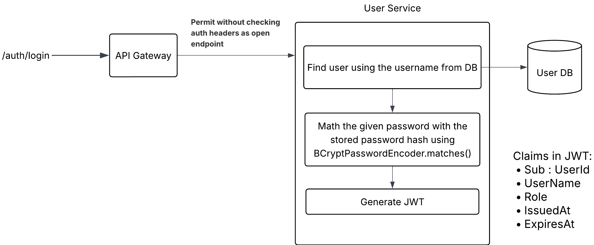
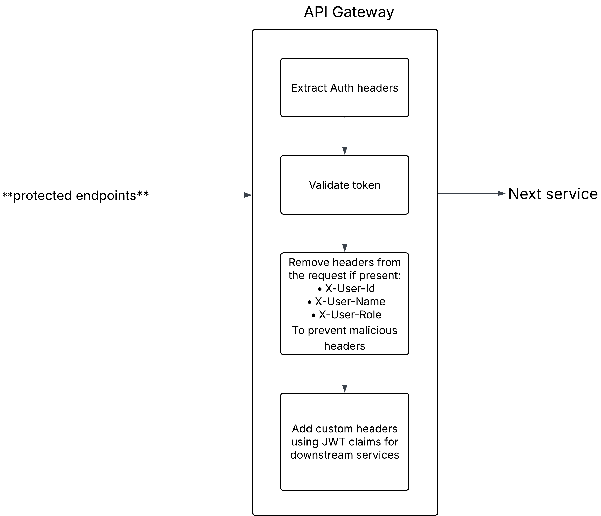
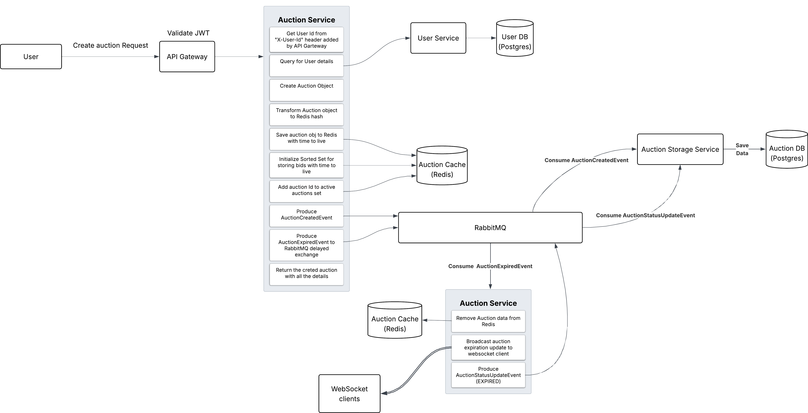
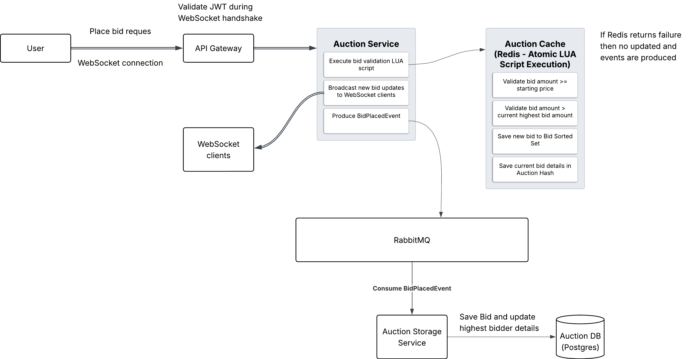

# BidWars – Event-Driven Real-Time Auction System


BidWars is a distributed, event-driven real-time auction system built using a Spring Boot microservice architecture. It allows users to register, create auctions, and participate in active bidding sessions in real time with minimal latency.

The system handles high-frequency bid requests in-memory via Redis (leveraging Lua scripts for atomic validations) and asynchronously syncs the auction updates and bid histories back to PostgreSQL databases using RabbitMQ queue consumers. This decouples fast, reactive operations from disk writes.

---

## Tech Stack

* **Language & Core Framework**: Java, Spring Boot
* **Microservices Components**: Spring Cloud Gateway, Spring Cloud OpenFeign, Netflix Eureka Service Discovery, Spring Boot Admin Server
* **Real-time Messaging**: Spring WebSocket (STOMP Protocol)
* **Databases & Caching**: PostgreSQL (persistent storage), Redis (rate-limiting and active bidding memory state)
* **Message Broker**: RabbitMQ (asynchronous persistence)
* **Containerization**: Docker, Docker Compose

---

## Key Features

* **Distributed Microservices**: Clean modular architecture using Spring Boot, Eureka Service Discovery, Spring Boot Admin monitoring, and API Gateway routing.
* **Atomic Bid Validations**: In-memory Redis active auction state combined with custom atomic Lua scripts to execute thread-safe bidding checks.
* **Asynchronous Persistence**: Decoupled persistence flow with RabbitMQ queues syncing active bidding states back to persistent PostgreSQL databases.
* **Real-Time Subscription**: Bid updates and auction expirations are broadcasted immediately to active bidders via STOMP WebSocket channels.
* **Direct Query Optimization**: Bypasses the high-throughput active Auction Service for read-heavy history operations, routing bid history and raw auction data requests directly through the Gateway to the Auction Storage Service.
* **Resilient Request Pipeline**: Protected by Gateway authentication, JWT-based rate limiting, exponential retries, and dedicated circuit breakers (AUCTION-CIRCUIT-BREAKER and AUCTION-STORAGE-CIRCUIT-BREAKER) that trip at a 50% failure threshold with a 5-second recovery window.

---

## System Details and Design Diagrams

### High-Level Architecture (HLD)



### Database Schema



### User Authentication Flows

#### Registration Flow


#### Login Flow


#### JWT Validation Flow


### Core Auction and Bidding Sequences

#### Create Auction Flow



#### Place Bid Flow



---

## API Documentation

The complete list of HTTP endpoints, parameters, header requirements, and payload schemas is documented in the following formats:
* **OpenAPI Specification**: Refer to [API_docs.yaml](./API_docs.yaml)
* **Interactive UI**: Open [API_docs.html](./API_docs.html) directly in any web browser to view and interact with the endpoints using the Swagger UI interface.

> Note: **Only the `bid-history` endpoint** (`/storage/bid-history/{id}`) is exposed to external clients through the API Gateway. All other storage service endpoints are internal.
---

## Run Using Docker

### Prerequisites
* Docker
* Docker Compose

```bash
cp SAMPLE.env .env
```
Edit the `.env` file.

 **Launch Services**
   ```bash
   docker compose up --build -d
   ```

**Verify Deployment**:
   Verify that all containers are healthy:
   ```bash
   docker compose ps
   ```

---

## Exposed Ports (Some ports are exposed for testing only)
| Service | Host Port | Internal Container Port | Description |
| :--- | :--- | :--- | :--- |
| **api-gateway** | `8000` | `8000` | Gateway entry point routing traffic downstream |
| **discovery-service** | `8761` | `8761` | Eureka discovery service registry dashboard |
| **admin-server** | `9090` | `9090` | Spring Boot Admin panel for monitoring microservice status |
| **rabbitmq** | `5672` | `5672` | RabbitMQ broker port for message queue exchanges |
| **rabbitmq** | `15672` | `15672` | RabbitMQ management dashboard |
| **user-service** | `8100` | `8100` | User account authentication and profile service |
| **auction-service** | `8200` | `8200` | Main bidding, WebSocket, and active auction service |
| **auction-storage-service** | `8090` | `8090` | PostgreSQL storage manager (internal Feign APIs) |

## Load Test Results

* **Total VUs:** 200
* **Iterations:** 200
* **Duration:** 60s
* **Successful connections:** 200
* **Bids sent:** 194,102 (≈ 3,211 bids/s)
* **WebSocket messages sent:** 194,502 (≈ 3,218 msgs/s)
* **WebSocket messages received:** 656,440 (≈ 10,859 msgs/s)
* **Data sent:** 45 MB (≈ 737 KB/s)
* **Data received:** 200 MB (≈ 3.3 MB/s)
* **WebSocket connection latency:** avg 120.97 ms (min 34.68 ms, max 278.84 ms)
* **WebSocket session duration:** avg 1 min
